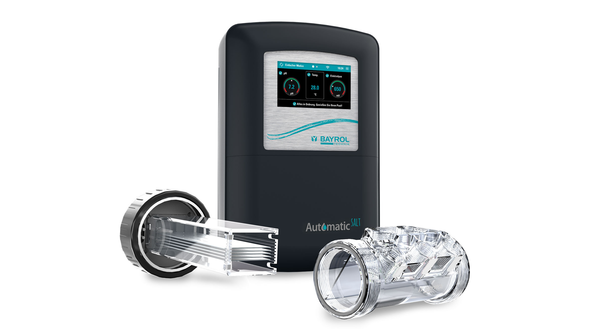

# Bayrol PoolAccess to Mqtt

### Bayrol PoolAccess (eg Automatic Salt Products) to MQTT Bridge

**bayrol-poolaccess-mqtt** allows you to connect to bayrol poolaccess server and publish data to your Home Assistant Mqtt broker.

### Check out the [documentation](https://tdenolle.github.io/bayrol-poolaccess-mqtt/) to get started!

## Contact & Support

- Create a [GitHub issue](https://github.com/tdenolle/bayrol-poolaccess-mqtt/issues) for bug reports, feature requests, or questions
- Add a ⭐️ [star on GitHub](https://github.com/tdenolle/bayrol-poolaccess-mqtt) to support the project!

## License

This project is licensed under the [MIT license](https://github.com/tdenolle/bayrol-poolaccess-mqtt/blob/master/LICENSE).