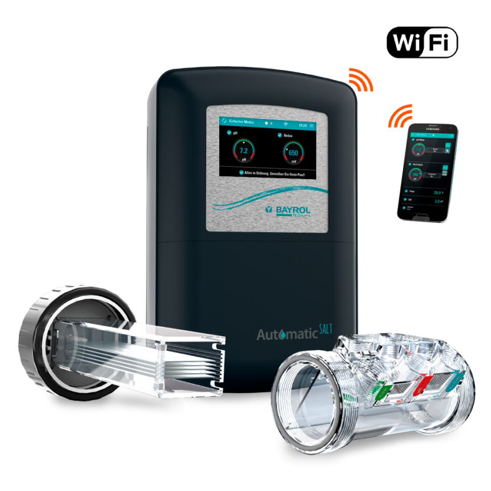

# Bayrol PoolAccess to MQTT

![Supports arm64 Architecture][arm64-shield] 
![Supports amd64 Architecture][amd64-shield] 
![Supports armv6 Architecture][armv6-shield] 
![Supports armv7 Architecture][armv7-shield]

### Bayrol PoolAccess (eg Automatic Salt Products) to MQTT Bridge

**bayrol-poolaccess-mqtt** allows you to connect to bayrol poolaccess server and publish data to your Home Assistant Mqtt broker.

## Contact & Support

- Create a [GitHub issue](https://github.com/tdenolle/bayrol-poolaccess-mqtt/issues) for bug reports, feature requests, or questions
- Add a ⭐️ [star on GitHub](https://github.com/tdenolle/bayrol-poolaccess-mqtt) to support the project!

## License

This project is licensed under the [MIT license](https://github.com/tdenolle/bayrol-poolaccess-mqtt/blob/master/LICENSE).

[amd64-shield]: https://img.shields.io/badge/amd64-yes-green.svg
[armv6-shield]: https://img.shields.io/badge/armv6-yes-green.svg
[armv7-shield]: https://img.shields.io/badge/armv7-yes-green.svg
[arm64-shield]: https://img.shields.io/badge/arm64-yes-green.svg